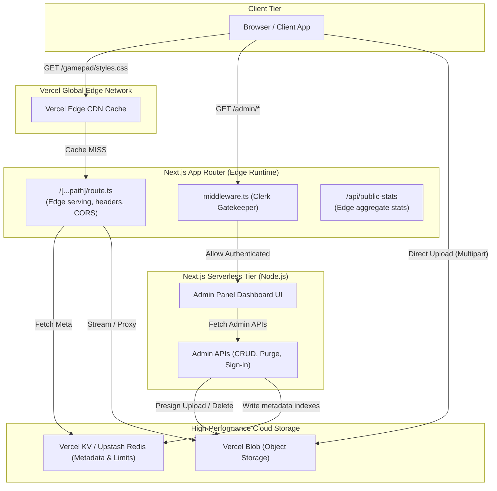

# 🚀 Ultra-Fast Static CDN & Secure Admin Portal

[](LICENSE)
[](https://nextjs.org)
[](https://vercel.com)
[](https://clerk.com)
[](https://upstash.com)

A production-grade, screamingly-fast static file CDN paired with a stunning dark-themed CRUD admin dashboard. Engineered to run entirely at the **Vercel Edge** for sub-millisecond delivery, maximum scalability, and bulletproof security.

**Live URL Example:** `https://static.yourdomain.com/gamepad/styles.css`  
**Admin Portal:** `https://static.yourdomain.com/admin` (Auth-protected)

---

## 🏗️ Architecture Overview



---

## ⚡ Tech Stack & Performance

- **Framework:** Next.js 14 (App Router)
- **CDN Engine:** Built entirely as a Next.js Catch-All route running on the **Edge Runtime** to bypass serverless cold starts and stream files globally with zero latency.
- **Storage:** **Vercel Blob** for highly available, scalable file object storage.
- **Metadata & Indexing:** **Vercel KV (Upstash Redis)** for sub-millisecond mapping of custom paths to physical Blob URLs, folder structures, and real-time statistics.
- **Authentication:** **Clerk Authentication** with secure OAuth and passwordless single-sign-on (SSO) integrated at the edge.
- **Rate Limiting:** Custom Edge-native sliding-window rate limiter using Redis pipelines. Identifies clients via secure SHA-256 multi-dimensional environment fingerprinting (IP + User Agent + Accept Language + Platform).
- **Premium UI Design:** Hand-crafted, zero-dependency Dark UI incorporating backdrop filters (glassmorphism), harmonized HSL color tokens, responsive layouts, skeleton states, and micro-animations.

---

## ⚙️ Environment Setup

To run this project, you need credentials for Vercel Blob, Vercel KV, and Clerk.

Create a `.env.local` file in the root directory (based on [.env.local.example](.env.local.example)):

```env
# Vercel Blob Token
BLOB_READ_WRITE_TOKEN="vercel_blob_rw_..."

# Vercel KV (Upstash Redis)
KV_REST_API_URL="https://..."
KV_REST_API_TOKEN="..."

# Clerk Authentication Keys
NEXT_PUBLIC_CLERK_PUBLISHABLE_KEY="pk_..."
CLERK_SECRET_KEY="sk_..."

# Clerk Redirect Mappings
NEXT_PUBLIC_CLERK_SIGN_IN_URL=/admin/sign-in
NEXT_PUBLIC_CLERK_AFTER_SIGN_IN_URL=/admin
NEXT_PUBLIC_CLERK_AFTER_SIGN_UP_URL=/admin

# Application Context
NEXT_PUBLIC_CDN_BASE="https://static.yourdomain.com"
MAX_FILE_SIZE_MB=500
```

---

## 🔒 Security Hardening

This CDN is designed to be open source while providing commercial-grade security for your files:

1. **Anti-Scraping / No Direct Directory Listing:** It is impossible to list, scrape, or search for files without knowing the exact URL. Requests for missing files or blocked sessions return generic 404s to block directory scanners.
2. **Edge Traversal Blocking:** Aggressive path parameter sanitization blocks double encoding, control characters, null bytes, and traversal commands (e.g. `../`).
3. **Robust CORS Control:** Serves files with `Access-Control-Allow-Origin: *` so you can hotlink fonts, styles, scripts, and media across different sites safely, complete with instant Edge-based `OPTIONS` preflight responses.
4. **Caching Headers:** Files are served with `public, max-age=31536000, immutable` alongside server ETag checking, resulting in instant `304 Not Modified` payload-free responses.
5. **Robots.txt & X-Robots-Tag:** Built-in dynamic robots handler and HTTP headers instruct AI scrapers and search bots to bypass indexing your asset files and administrative backends.

---

## 🎛️ Admin Features

- **Interactive Analytics:** Track storage usage against limits, check indexed counts, and watch live status logs.
- **File Browser:** Fluid visual hierarchy supporting grid/list layouts, real-time filtering, instant breadcrumb jumps, folder nesting, renaming, moving, and link generation.
- **Direct Multipoint Uploads:** Supports drag-and-drop multi-file concurrent uploads. Employs secure client-side pre-signing so uploads bypass Serverless Function timeouts/limits entirely.
- **Instant Cache Purger:** Purge metadata and invalidate Vercel CDN caches instantly for any given file path.

---

## 🚀 Deployment Guide

This project is built to deploy on **Vercel** with a single click.

### Step 1: Clone and Push to GitHub

Create a new repository on your GitHub account and push the code:

```bash
git remote add origin git@github.com:yourusername/static.git
git branch -M main
git push -u origin main
```

### Step 2: Set Up Clerk Auth

1. Go to [Clerk.com](https://clerk.com) and create a new application.
2. Enable the Sign In options you prefer (Email, Google, etc.).
3. Under **API Keys**, copy the Publishable Key and Secret Key.

### Step 3: Deploy to Vercel

1. Log in to your [Vercel Dashboard](https://vercel.com).
2. Click **Add New > Project**, and select your GitHub repository.
3. In the **Environment Variables** section, add all keys from `.env.local.example` (using your Clerk keys, Vercel KV URLs, etc.).
4. Click **Deploy**.

### Step 4: Configure Storage Integrations

1. Once deployed, navigate to the **Storage** tab on your Vercel Project Dashboard.
2. Connect a new **Vercel Blob** database.
3. Connect a new **Vercel KV (Redis)** database.
4. Vercel will automatically inject `BLOB_READ_WRITE_TOKEN`, `KV_URL`, `KV_REST_API_URL`, and `KV_REST_API_TOKEN` to your Environment Variables.
5. Redeploy/Promote to Production so Vercel hooks up the storage tokens.

---

## 🛠️ Local Development

1. **Install Dependencies:**
   ```bash
   npm install
   ```
2. **Start Dev Server:**
   ```bash
   npm run dev
   ```
3. **Quality Verification Hooks:**

   ```bash
   # TypeScript verification
   npx tsc --noEmit

   # Lint check
   npm run lint

   # Production build
   npm run build
   ```

---

## 📄 License

This project is open source and licensed under the [MIT License](LICENSE).
